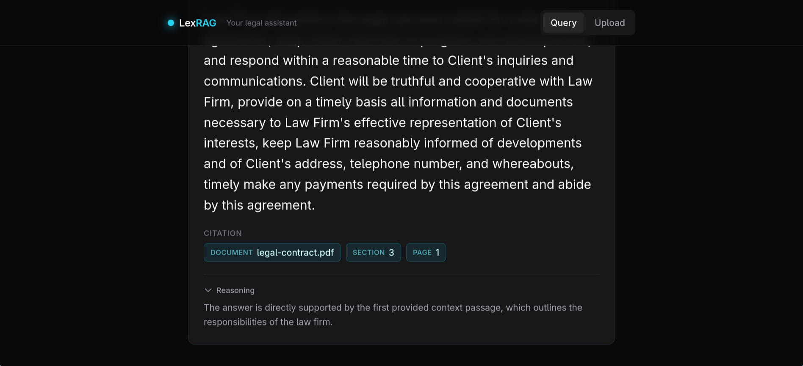
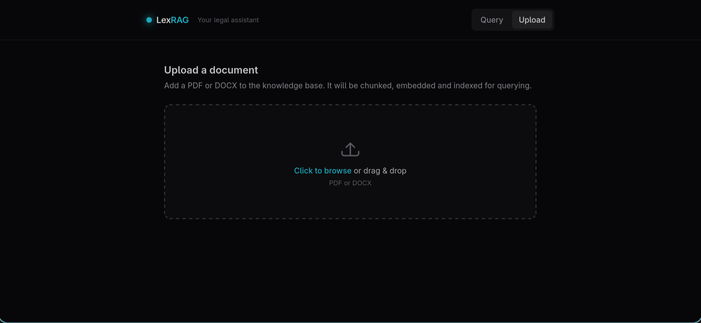

# LexRAG

A retrieval-augmented Q&A system for legal documents that answers with clause-level citations and a confidence score — not just a wall of retrieved text.

## Demo






## What it does

LexRAG ingests legal documents (PDF/DOCX), preserves their Section → Clause → Sub-clause structure during chunking, and indexes them for semantic search. At query time it retrieves and reranks the most relevant passages, then synthesizes a grounded answer with a structured citation pointing back to the exact clause and page. Every answer carries a confidence rating, and low-evidence queries are rejected before they ever reach the language model.

## Why it's different from generic RAG

Most RAG demos split text on a fixed character window, dump the top-k chunks into a prompt, and return prose. For legal documents that loses the two things that matter most — *where* a statement comes from and *how structurally intact* the source is. LexRAG is built around three differences:

- **Hierarchy-preserving chunking.** Documents are parsed into Section/Clause/Sub-clause blocks first, then chunked *within* each block. A chunk never straddles a clause boundary, and every chunk carries its hierarchy tags.
- **Clause-level citation grounding.** Answers cite the specific document, section, clause, and page — surfaced in the UI as distinct chips, not buried in the prose.
- **Structured JSON output with confidence scoring.** Synthesis returns a typed object (`answer`, `citation`, `confidence`, `reasoning`). A reranker-score gate returns "insufficient evidence" instead of hallucinating when nothing relevant is found.

## Architecture

```
  INGESTION
  ┌────────┐   ┌─────────┐   ┌──────────────┐   ┌────────┐   ┌───────┐   ┌─────────┐
  │ Upload │──▶│ Extract │──▶│ Hierarchy    │──▶│ Chunk  │──▶│ Embed │──▶│  Store  │
  │PDF/DOCX│   │ + font  │   │ Parse        │   │ within │   │ (BGE) │   │(MongoDB)│
  │        │   │ metadata│   │ §→clause→sub │   │ block  │   │       │   │         │
  └────────┘   └─────────┘   └──────────────┘   └────────┘   └───────┘   └─────────┘

  QUERY
  ┌────────┐   ┌────────────┐   ┌────────┐   ┌────────┐   ┌────────────┐   ┌──────────────┐
  │ Query  │──▶│ Embed Query│──▶│ FAISS  │──▶│ Rerank │──▶│ Synthesize │──▶│ Cited Answer │
  │ text   │   │ (BGE +     │   │ top-k  │   │(MiniLM │   │ (Ollama,   │   │ + confidence │
  │        │   │  prefix)   │   │ cosine)│   │ cross- │   │  JSON out) │   │ + reasoning  │
  └────────┘   └────────────┘   └────────┘   │ enc.)  │   └────────────┘   └──────────────┘
                                             └────────┘   ▲
                                                          │ score gate: below threshold →
                                                          │ "insufficient evidence" (no LLM call)
```

## Tech stack

| Layer | Tool | Purpose |
|---|---|---|
| Backend | FastAPI (Python 3.14) | Async API for upload + query routes |
| Frontend | React 18 + Vite | SPA, fast dev/build |
| Frontend | Tailwind CSS | Dark-theme styling, single cyan accent |
| Frontend | Framer Motion | Answer-reveal and transition animations |
| Frontend | Axios | HTTP client to the backend |
| AI/ML | BGE `bge-base-en-v1.5` | Dense embeddings (asymmetric query/passage) |
| AI/ML | MS MARCO `MiniLM-L-6-v2` | Cross-encoder reranking |
| AI/ML | Ollama `qwen2.5:1.5b` | Local synthesis with structured JSON output |
| AI/ML | FAISS (`IndexFlatIP`) | In-memory cosine similarity search |
| Storage | MongoDB 8 (Docker) | Document + chunk persistence (embeddings as float lists) |
| Parsing | pdfplumber | PDF text + per-character font metadata |
| Parsing | python-docx | DOCX paragraph extraction |
| Parsing | LangChain `RecursiveCharacterTextSplitter` | Chunking with token-based length |
| Parsing | tiktoken (`cl100k_base`) | Token counting for chunk sizing |

## Key engineering decisions

**BGE asymmetric prefix enforced structurally.** BGE is an asymmetric model — queries must be prefixed (`"Represent this sentence for searching relevant passages:"`), passages must not. Rather than relying on callers to remember this, the prefix lives in a dedicated `embed_query()` method separate from `embed_chunk()`. The correct behavior is a property of the API, not a convention. *(`backend/app/models/embedding_model.py`)*

**Recursive character splitting with token-based length.** Chunking uses `RecursiveCharacterTextSplitter` (`chunk_size=300`, `overlap=50`) with a tiktoken `length_function`, instead of semantic/multi-signal splitting. The payoff is predictable token-sized chunks regardless of source formatting, which keeps embedding quality and retrieval behavior consistent across wildly different documents. *(`backend/app/services/ingestion_service.py`)*

**Block-then-chunk hierarchy preservation.** The hierarchy parser produces Section/Clause/Sub-clause blocks *before* chunking; each block is then split independently. This guarantees a chunk never spans two clauses and that every chunk inherits accurate hierarchy tags — which is what makes clause-level citation possible downstream. *(`backend/app/services/ingestion_service.py`, `hierarchy_parser.py`)*

**Decoupled synthesis backend.** Synthesis is isolated behind a single `synthesize(query, top_chunks)` function with a provider-agnostic return schema. The project started on the Gemini API; when a Google account-level restriction blocked `AIza` key generation, swapping to a local Ollama model was a single-function change — the threshold gate, prompt, JSON parsing, and error handling were untouched. *(`backend/app/services/synthesis_service.py`)*

## Author / Acknowledgements

The concept evolved from work on **PRISM**, Profinch's RFP automation tool, where two retrieval limitations surfaced during analysis: chunking that didn't preserve clause boundaries (limiting citation accuracy) and answers without traceable source locations. LexRAG is a from-scratch exploration of solving both — structure-aware chunking and clause-level citation grounding — in a legal document context.
